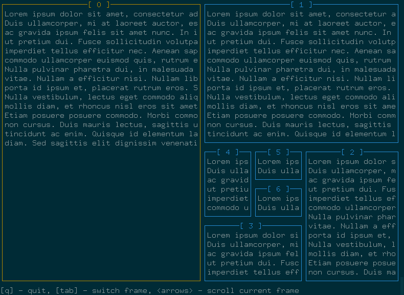

# hello-brick

### About

This is a small experiment with [brick](https://hackage.haskell.org/package/brick) library.

Each of the app's frames shows a separate *viewport* - a scrollable container
for the containing widgets. User can switch between frames and scroll any of them separatedly.

### How to

`cabal build` & `cabal run hello-brick`
